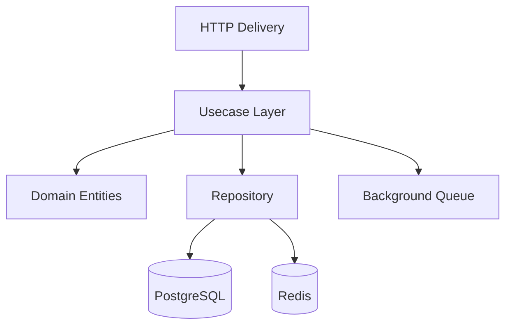

# Go-Redis-PostgreSQL

[](https://go.dev/)
[](https://www.docker.com/)
[](https://redis.io/)
[](https://www.postgresql.org/)

A high-performance task management API built with Go, leveraging Redis for advanced caching and rate limiting, and PostgreSQL for persistent storage. This project demonstrates industry-standard patterns like Clean Architecture and Distributed Locking.

## Key Features

| Implementation | Technology | Component |
|:---|:---|:---|
| **Persistent Storage** | PostgreSQL + sqlc | `internal/repository` |
| **Efficient Caching** | Redis Hash (`HSET/HGETALL`) | `internal/repository` |
| **Atomic Rate Limiting** | Redis Lua Scripting | `internal/middleware` |
| **Distributed Locking** | Redis `SET NX PX` Pattern | `internal/lock` |
| **Asynchronous Processing** | Background Worker (LPUSH/BRPOP) | `internal/queue` |

## System Architecture

The project follows **Clean Architecture** principles to ensure maintainability, scalability, and testability.



### Directory Structure

- `internal/domain`: Core entities and repository interfaces.
- `internal/usecase`: Business logic and application flow controls.
- `internal/repository`: Optimized data access logic for SQL and NoSQL.
- `internal/delivery`: RESTful API endpoints and HTTP orchestration.
- `internal/middleware`: Distributed rate limiting and security layers.
- `internal/lock`: Resource synchronization using distributed mutexes.

## Getting Started

### Environment Setup

1. Clone the repository:
   ```bash
   git clone https://github.com/cihanisildar/go-redis.git
   cd go-redis
   ```

2. Initialize environment variables:
   ```bash
   cp .env.example .env
   ```

3. Deploy using Docker Compose:
   ```bash
   docker compose up --build -d
   ```

The API service will be exposed at `http://localhost:8010`.

## API Reference

### Task Management

| Method | Endpoint | Description |
|:---:|:---|:---|
| `POST` | `/tasks` | Create a new task entity |
| `GET` | `/tasks` | Retrieve all tasks (cached) |
| `GET` | `/tasks/{id}` | Fetch task details by ID |
| `PUT` | `/tasks/{id}/done` | Update status to completed |
| `DELETE` | `/tasks/{id}` | Permanently remove a task |

### System Status

| Method | Endpoint | Description |
|:---:|:---|:---|
| `GET` | `/queue/stats` | Real-time background worker metrics |

## Tech Stack & Dependencies

- **Runtime:** Go 1.21+
- **Primary Database:** PostgreSQL 16
- **Object Cache & Messaging:** Redis 7
- **Database Driver:** [pgx/v5](https://github.com/jackc/pgx)
- **Code Generation:** [sqlc](https://sqlc.dev/) for type-safe SQL operations.
- **Redis Client:** [go-redis/v9](https://github.com/redis/go-redis)